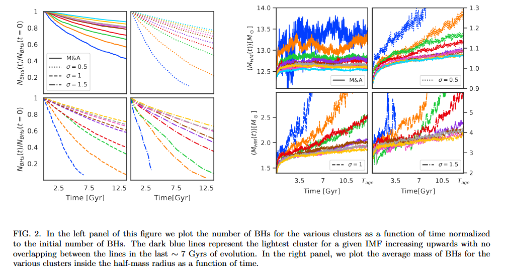
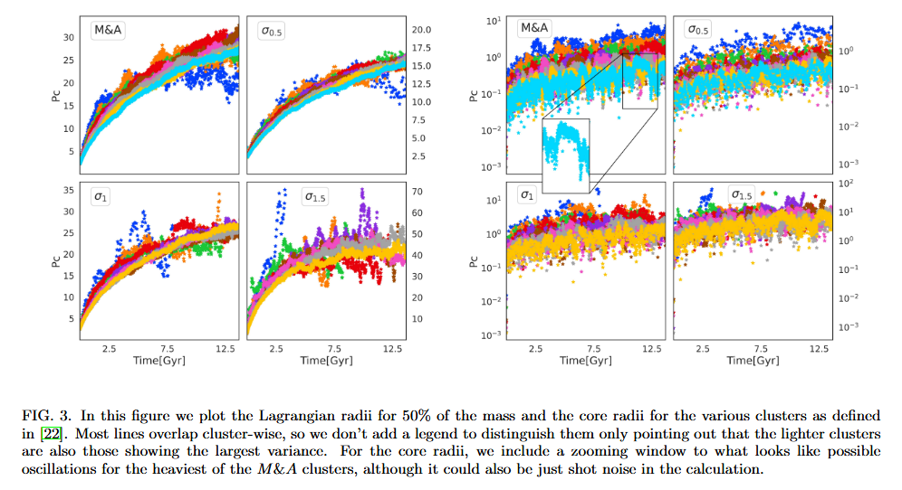

# About

This experiment is based on article [Primordial Black Hole clusters, phenomenology & implications](https://arxiv.org/pdf/2405.06391v1) by Juan Garcia-Bellido (shortly: JGB).

The goal of this experiment is to create a self-consistent model with Plummer density profile and log-normal mass spectrum, and then evolve it for Hubble time.


Mass spectra used in the article.

# How to reproduce

To reproduce the experiment, follow these steps:

- Activate the Agama environment:

  ```shell
  conda activate agama
  ```

- Start Nemo (from `nemo` repository root):

  ```shell
  source start_nemo.sh
  ```

- Switch to custom NEMO version (needed for NbodyX methods):

  ```shell
  cd $NEMO
  git remote add custom https://github.com/savchenkoyana/nemo.git
  git checkout nbodyx
  cd src/nbody/evolve/aarseth/nbody0
  make nmax
  cd $NEMO
  make rebuild
  ```

  If you want to go back to the default NEMO version, run:

  ```shell
  cd $NEMO
  git checkout master
  make rebuild
  ```

- Go to the experiment root directory:

  ```shell
  cd /path/to/Nbody/02_Reproduce_JGB/
  ```

- To reproduce any experiment from the original article, run the corresponding sh-script. For example:

  ```shell
  bash sh_scripts/run_exp_MA.sh
  ```

  You can also choose your own parameters for distributions and run the commands from sh-script one-by-one (see next section).

  > Note that all scripts in this experiment overwrite the existing files.
  > Don't forget to backup your experiments before trying to reproduce them!

The combinations of parameters from the original article and corresponding sh-scripts are listed below:

| Experiment name | $\\mu$, $M\_{☉}$ | s, $M\_{☉}$ | $\\sigma$ | Plummer radius, pc | Number of particles | Script to reproduce evolution  |
| --------------- | ---------------- | ----------- | --------- | ------------------ | ------------------- | ------------------------------ |
| $\\sigma$ = 0.5 | 0                | 1           | 0.5       | 10                 | $2 \\times 10^4$    | sh_scripts/run_exp_sigma0.5.sh |
| $\\sigma$ = 1   | 0                | 1           | 1         | 10                 | $2 \\times 10^4$    | sh_scripts/run_exp_sigma1.0.sh |
| $\\sigma$ = 1.5 | 0                | 1           | 1.5       | 10                 | $2 \\times 10^4$    | sh_scripts/run_exp_sigma1.5.sh |
| M & A           | 10               | 1.5         | 0.954     | 10                 | $2 \\times 10^4$    | sh_scripts/run_exp_MA.sh       |

## More detailed overview

This section desctibes how to perform the evolution of PBH cluster in an external potential of SMBH.

- Create initial coordinates of cluster:

  ```shell
  python create_ic.py --mu <MU> --sigma <SIGMA> --scale <SCALE> --r <PLUMMER_RADIUS> --N <N>
  ```

  Here `N` is the number of particles in simulation, `MU`, `SIGMA`, and `SCALE` are log-normal distribution parameters of PBH mass spectrum, and `PLUMMER_RADIUS` is a characteristic size of Plummer density distribution (type `python create_ic.py --help` for more details).

  The above command will automatically create (or re-create) a directory with name `snap_mu<MEAN>_s<SCALE>_sigma<SIGMA>_r<PLUMMER_RADIUS>_N<N>` containing file `IC.nemo` with initial coordinates for evolution.

- Preprocess data

  JGB writes:

  > Clusters are themselves immersed in a central gravitational potential with orbital radius $R_c$ = 34 kpc and central mass $M = 4.37 × 10^{10} M\_{☉}$ throughout the entire evolution. This is just a point mass approximation which leads to a circular movement of period T = 2.81 Gyr

  The easiest way to create this point-mass potential is to add a new particle representing the central mass to the existing snapshot with PBH cluster data:

  ```shell
  python preprocess_snap.py \
    --nemo-file `DIRNAME`/IC.nemo \
    --r 10 \
    --r-shift 34 0 0 \
    --v-shift 0 -74.35014 0 \
    --add-point-source \
    --source-mass 4.37e10
  ```

  After this step, you will get a new file `<DIRNAME>/IC_preprocessed.nemo` with the old data concatenated with the new data (a steady point of mass $4.37\\times10^{10} M\_\\odot$ at (0, 0, 0)).

  Note that `preprocess.py` also converts parsecs to kiloparsecs for convenience using NEMO's `snapscale`. The reverse transformation is performed by `postrprocess.py`.

- Run evolution of this snapshot with SMBH:

  ```shell
  gyrfalcON in=<DIRNAME>/IC_preprocessed.nemo out=<DIRNAME>/<OUT_NAME>.nemo eps=<eps> kmax=<kmax> Grav=<Grav> tstop=<tstop> step=<step> logstep=300
  ```

  A set of recommended parameters for `gyrFalcON` is provided by `preprocess_snap.py` script at the end of its output.

- It would be useful to postprocess your data to plot profiles, spectras, etc.

  To postprocess snapshot evolved in JGB potential (the original article), run:

  ```shell
  python postprocess.py --nemo-file <DIRNAME>/<OUT_NAME>.nemo --remove-point-source
  ```

  The postprocessed file with name `<OUT_NAME>_postprocessed.nemo` will be stored in `<DIRNAME>` folder.

# Explore results

## Visualize cluster evolution

- To visualize cluster evolution, run:

  ```shell
  snapplot <DIRNAME>/out.nemo
  ```

  Use these options for customization:

  ```shell
  snapplot <DIRNAME>/out.nemo xrange=<xmin>:<xmax> yrange=<ymin>:<ymax> times=<tmin>:<tmax>
  ```

- There is also a possibility to visulaize the evolution using [glnemo2](https://projets.lam.fr/projects/glnemo2/wiki/download).

- Another option is to use custom visualization script from this repository:

  ```shell
  python animate.py --nemo-file <DIRNAME>/out_postprocessed.nemo --times <t1> <t2> ... <tn> --add-point-source
  ```

  `--times <t1> <t2> ... <tn>` means that all timestamps from snapshot that you want to use to plot the graph should be separated by a space.
  E.g., `--times 0.0 1.0 2.0`. Before feeding timestamps, make sure they are present in the snapshot. To get a list of timestamps from a snapshot, run:

  ```shell
  python stat.py --nemo-file <DIRNAME>/<OUT_NAME>_postprocessed.nemo --n-timestamps <N>
  ```

  where `<N>` is the desired number of timestamps.

  > If you used sh-scripts, check `timestamps.txt` file in directory with your snapshot

## Plot density profile $$\\rho(r)$$

Plot density profile $$\\rho(r)$$ for the resulting snapshot and compare it with initial density:

```shell
python plot_density_profile.py --nemo-file <DIRNAME>/<OUT_NAME>_postprocessed.nemo --times <t1> <t2> ... <tn> --mean <MEAN> --sigma <SIGMA> --scale <SCALE> --r <PLUMMER_RADIUS>
```

## Plot Lagrange radii

To plot Lagrange radius at different timestamps for different experiments, run:

```shell
python plot_lagrange_radius.py --nemo-files <DIRNAME1>/<OUT_NAME>_postprocessed.nemo <DIRNAME2>/<OUT_NAME>_postprocessed.nemo --times <t1> <t2> ... <tn>
```

As NEMO's tool for computation of cluster's density center sometimes fail and I haven't fixed it yet, it is better to add `--remove-outliers` at the end of the command:

```shell
python plot_lagrange_radius.py --nemo-files <DIRNAME1>/<OUT_NAME>_postprocessed.nemo <DIRNAME2>/<OUT_NAME>_postprocessed.nemo --times <t1> <t2> ... <tn> --remove-outliers
```

You can compare your results with plots from the article:





Note that Lagrange radius at t=0 should be approximately 13 pc according to [analytical expression](https://en.wikipedia.org/wiki/Plummer_model) for Plummer with size 10 pc

## Plot mass spectrum $$f(M)$$

Compute and plot mass spectrum for a given snapshot along with the original distribution function:

```shell
python plot_mass_spectrum.py --nemo-file <DIRNAME>/<OUT_NAME>_postprocessed.nemo --times <t1> <t2> ... <tn> --mean <MEAN> --sigma <SIGMA> --scale <SCALE> --r <PLUMMER_RADIUS>
```

The mass distribution for your snapshot (the resulting histograms) and original pdf (the line plot) should look like a log-normal distribution with your parameters at $t=0$. You can compare your results with the picture of log-normal distributions at the beginning of this README document.

To plot the distribution of masses only for particles inside the half-mass radius, run:

```shell
python plot_mass_spectrum.py --nemo-file <DIRNAME>/<OUT_NAME>_postprocessed.nemo --times <t1> <t2> ... <tn> --mean <MEAN> --sigma <SIGMA> --scale <SCALE> --r <PLUMMER_RADIUS> --lagrange --remove-outliers
```

# Test pipeline

To test your pipeline, you may evolve a cluster in its own gravitational field (without any potentials). The final density after the evolution should look like the initial density. This indicates that your model is truly self-consistent.

# Compare with precise Nbody methods

Many researchers use Nbody6++GPU in order to perform evolution of clusters. We need to compare our method (fast gytFalcON with complexity $O(N)$) with precise but slow Nbody methods with complexity $O(N^2)$ to make sure that our method suits good for this task.

## How to perform evolution with Nbody

To run both gyrFalcON and Nbody0 methods together, use `1` in argument:

```shell
bash sh_scripts/run_exp_MA.sh 1
```

## Compare results

You can compare results visually (by running `animate.py`) or plot all statistics: density profile, mass spectrum or lagrange radius.

To plot lagrange radii for gyrFalcON and Nbody0 together, run this command:

```shell
python plot_lagrange_radius.py \
  --remove-outliers \
  --nemo-files /path/to/dir1/out_postprocessed.nemo ... /path/to/dirn/out_postprocessed.nemo \
  --mu <MU> \
  --sigma <SIGMA> \
  --scale <SCALE> \
  --times t1 ... tn \
  --nbody-nemo-files /path/to/dirn/out_nbody_postprocessed.nemo \
  --nbody-times t1 ... tn
```

> Note that timestamps for gyrFalcON and Nbody0 will likely differ, so we feed them separately. There is also a way to get the nearest timestamp in snapshot using NEMO's `snaptrim` with option `timefuzz=nearest`. However, there is a [bug](https://github.com/savchenkoyana/Nbody/issues/9) related to close timestamps in a simulation snapshot. So my way is uglier but less error prone.

# Checklist

Here is a list of what we need to fully reproduce the article:

- [x] N-body simulation
- [ ] Comparison between Nbody6++GPU (or Nbody6) and GyrfalcON
- [ ] Gravitational waves
- [ ] Black hole mergers
