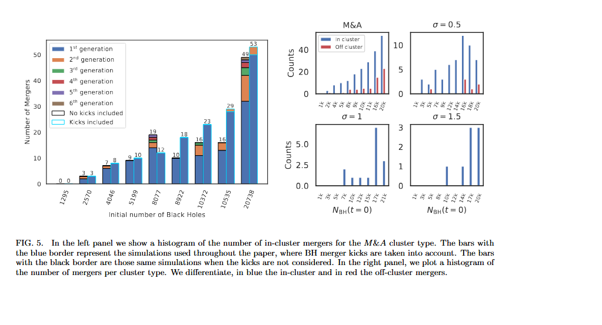

This experiment is based on article [Primordial Black Hole clusters, phenomenology & implications](https://arxiv.org/pdf/2405.06391v1) by Juan Garcia-Bellido (shortly: JGB).

The goal of this experiment is to create a self-consistent model with Plummer density profile and log-normal mass spectrum, and then evolve it for Hubble time.


Mass spectra used in the article.

# How to reproduce

To reproduce the experiment, follow these steps:

- Activate the Agama environment:

  ```bash
  conda activate agama
  ```

- Start Nemo (from `nemo` repository root):

  ```bash
  source start_nemo.sh
  ```

- Go to the experiment root directory:

  ```bash
  cd /path/to/Nbody/02_Reproduce_JGB/
  ```

- Prepare binaries (only once):

  ```bash
  ln -s ~/work/Nbody/Nbody6ppGPU/build/nbody6++.avx nbody6pp
  ln -s ~/work/Nbody/Nbody6PPGPU-beijing/build/nbody6++.avx nbody6pp-beijing
  ```

  Note that the name of binaries may differ if you used other options to build them. We will use `nbody6pp-beijing` binary for evolution and `nbody6pp` binary simply to convert data to the right format.

- Create initial coordinates of cluster:

  ```bash
  python create_ic.py --mu <MU> --sigma <SIGMA> --scale <SCALE> --r <PLUMMER_RADIUS> --N <N>
  ```

  Here `N` is the number of particles in simulation, `MU`, `SIGMA`, and `SCALE` are log-normal distribution parameters of PBH mass spectrum, and `PLUMMER_RADIUS` is a characteristic size of Plummer density distribution (type `python create_ic.py --help` for more details).

  The above command will automatically create (or re-create) a directory with name `snap_mu<MU>_s<SCALE>_sigma<SIGMA>_r<PLUMMER_RADIUS>_N<N>` containing file `IC.nemo` with initial coordinates for evolution.

- Prepare the input:

  To convert data to units with `G=1` (pc, km/s and $\\sim 232.5337 \\times M\_{☉}$), run:

  ```bash
  snapscale in=<OUTDIR>/IC.nemo \
    out=<OUTDIR>/IC_g1.nemo \
    mscale=4.300451321727918e-03
  ```

  > For more details about units see section [Units](#Units).

  Then transform data into Nbody6pp-format:

  ```bash
  runbody6 in=<OUTDIR>/IC_g1.nemo out=<OUTDIR>/outdir tcrit=0 nbody6=0 exe=nbody6pp
  cp <OUTDIR>/outdir/dat.10 <OUTDIR>/
  ```

  Then change `Rbar`, `Zmbar` and `Q` fields in your Fortran namelist input file (<OUTDIR>/input) according to this output:

  ```bash
  python scale.py --length 0.001 --mass 1 --velocity 1 --nemo-file <OUTDIR>/IC.nemo
  ```

  > Use absolute value of `Q`

  Also you may need to alter time in input file (`TCRIT`)

  Don't forget to change `N`! Also consider changing `NNBOPT` (the number of neighbors in Ahmad-Cohen scheme). I typically use $2\\times\\sqrt{N}$. If you use primordial binaries, you may also need to change config as well.

- Run evolution

  ```bash
  cd <OUTDIR>
  /path/to/nbody6pp-beijing< <input_name> 1>exp.out 2>exp.err
  ```

  You may track intermediate results by running (from exp root):

  ```bash
  bash sh_scripts/grep_on_update.sh <OUTDIR>/exp.out
  ```

  or

  ```bash
  tail -f <OUTDIR>/exp.out
  ```

- Postprocess your data to plot profiles, spectras, etc.

  Snapshot data are stored in `conf.3_*` in Nbody6++GPU-version. To transform it into NEMO snapshot, use:

  ```bash
  cat `ls -tr conf.3_*` > OUT3; u3tos OUT3 out.nemo mode=6 nbody=<N> ; rm OUT3
  ```

  where `<N>` is the number of particles in your simulation.

  Then to transform to astrophysical units:

  ```bash
  python snapscale.py --exp <OUTDIR>
  ```

  and finally:

  ```bash
  rm <OUTDIR>/out.nemo  # for saving space
  ```

  The resulting file will be `<OUTDIR>/out_scaled.nemo`

# Simulation output

In previous versions of direct N-body codes, the evolving algorithm produced many text outputs as well as simulation file `out.nemo`. Later Nbody6++GPU-beijing switched to hdf5 data format where everything is stored in a single file. A part of the next scripts uses nemo file and other part uses hdf5 file for historical reasons. But it is essential to build Nbody6++GPU-beijing with hdf5 support as there is no other easy way to get access to spin data other that use hdf5.

> Note that Nbody6++GPU is written on Fortran so it uses Fortran-style (1-based) array indexing while we use C-style (0-based) array indexing.

# Explore results

## Visualize cluster evolution

- To visualize cluster evolution, run:

  ```bash
  snapplot <OUTDIR>/out.nemo
  ```

  Use these options for customization:

  ```bash
  snapplot <OUTDIR>/out.nemo xrange=<xmin>:<xmax> yrange=<ymin>:<ymax> times=<tmin>:<tmax>
  ```

- There is also a possibility to visulaize the evolution using [glnemo2](https://projets.lam.fr/projects/glnemo2/wiki/download).

- Another option is to use custom visualization script from this repository:

  ```bash
  python animate.py --nemo-file <OUTDIR>/out.nemo
  ```

  Use `--xlim` and `--ylim` to set your own limits.

## Plot density profile $$\\rho(r)$$

Run:

```bash
python plot_density_profile.py --N 5000 \
  --mu 10 --scale 1.5 --sigma 0.954 \
  --nemo-file <OUTDIR>/out_scaled.nemo --n-timestamps 5
```

## Plot Lagrange radii

The easiest way to plot lagrange radii is to use data stored in log file:

- In Nbody units:

  ```bash
  python plot_nbody6_logdata.py --log-file <OUTDIR>/exp.out --values RLAGR
  ```

- In astro units:

  ```bash
  python plot_nbody6_logdata.py --log-file <OUTDIR>/exp.out --values RLAGR --astro-units
  ```

Note that you can also use `plot_lagrange_radius.py`. Use `out_scaled.nemo` to plot in astrophysical units.

> Note that if you don't remove escapers, the results may differ! You can remove escapers at post-processing using `remove_escapers.py` and re-run `plot_lagrange_radius.py` with post-processed data for checks (without any guarantees). The preferable way, however, is to remove escapers during cluster evolution.

Use `plot_stats.py` to plot $N(t)$ and $M(t)$ (these should be constant if you don't remove escapers)

You can compare your results with plots from the article:


Note that Lagrange radius at $t=0$ should be approximately 13 pc according to [analytical expression](https://en.wikipedia.org/wiki/Plummer_model) for Plummer with size 10 pc.

## Plot mass spectrum $$f(M)$$

Plot how mass changes with distance from center:

- In Nbody units:

  ```bash
  python plot_nbody6_logdata.py --log-file <OUTDIR>/exp.out --values AVMASS
  ```

- In astro units:

  ```bash
  python plot_nbody6_logdata.py --log-file <OUTDIR>/exp.out --values AVMASS --astro-units
  ```

## Explore mergers and GW radiation

First check if you got any events related to stellar evolution:

```bash
python parse_events.py --exp <OUTDIR>
```

As a result, you would get something like this:

```text
NTIDE: 0 (Tidal captures from hyperbolic motion (#27 > 0))
NCIRC: 0 (Circularized bianries (#27 > 0))
NRO: 0 (Roche binary events)
NCE: 0 (Common envelope binaries)
NSYNC: 0 (Number of synchronous binaries (#27 > 0))
NDISS: 1 (Tidal dissipations at pericentre (#27 > 0))
         Event 1 happened at T[NB]=807
NCOAL: 0 (Stellar coalescence)
NCOLL: 1 (Stellar collisions)
         Event 1 happened at T[NB]=807
NROCHE: 0 (Roche stage triggered times)
NHYPC: 0 (Hyperbolic common envelope binaries)
NDD: 0 (Double WD/NS/BH binaries)
NKICK: 1 (WD/NS/BH kick)
         Event 1 happened at T[NB]=807
NHYP: 0 (Hyperbolic collision)
```

To get plots and analysis relared to post-Newtonian corrections to Newtonian motion, run this Jupyter notebook with your data: [CoalescenceAnalysis.ipynb](CoalescenceAnalysis.ipynb).

Compare your results with plots from the article:




<!-- For `WD/NS/BH kick`:

```bash
grep " SPIN" <OUTDIR>/exp.out
```


Use:

```bash
grep "GR " -A 2 -B 2 nbody6++jgb_exp/N5000_MA/exp.out
``` -->

<!--
```bash
grep "NMERGE" nbody6++jgb_exp/N5000_MA/exp.out
``` -->

<!-- ```bash
grep "NEW MERGER" nbody6++jgb_exp/N5000_MA/exp.out
```

```bash
grep "NBH" -A 1 nbody6++jgb_exp/N5000_MA/exp.out
```

and

```bash
grep "NS/BH BINARY" nbody6++jgb_exp/N5000_MA/exp.out
```
 -->

# Compare with other N-body methods

The comparison with other methods is descriped in details in [README_NBODY.md](README_NBODY.md).

# Units

We use non-usual units in our experiments:

- We use astrophysical units for creating a cluster model because of convenience:
  - pc (length)
  - km/s (velocity)
  - $M\_{☉}$ (mass)
- We use units with `G=1` to feed data into N-body code:
  - pc (lenght)
  - km/s (velocity)
  - $\\sim 232.5337 \\times M\_{☉}$ (mass)
- Codes from `sh_scripts/run_othermethods.sh` compute the evolution in the units with `G=1` mentioned above
- Nbody6++GPU-beijing uses N-body units for computations. It also produces `conf.3_*` (and, as a result, `out.nemo`) in N-body units.
- The units of hdf5 output produced by Nbody6++GPU-beijing depend on whether stellar evolution is switched on. If enabled, all quantities in hdf5 file are in units of `RBAR[pc]`, `ZMBAR[solar masses]`, `TSCALE[Myr]`, `VSTAR[km/s]`, and gravitational constant is `G=4.302E-3`. Otherwise N-body units are used (?)

# Checklist

Here is a list of what we need to fully reproduce the article:

- [x] Comparison with other methods
- [x] Nbody6 (simple run)
- [x] Enable gravitational waves and black hole coalescence
- [ ] Set natal spins = 0 (random with `KZ(24)=2`)
