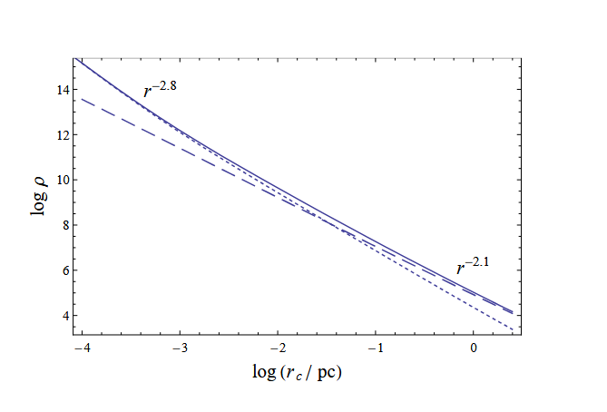

# About

This experiment demonstrates how to create a self-consistent model for a custom density function.
This is just a toy example based on [https://arxiv.org/pdf/1807.06590](https://arxiv.org/pdf/1807.06590)

We create two separate self-consistent models for black holes and dark matter densities:



Dark matter density – dashed line, black hole density – dotted line.

Asymptotically these potentials look as follows:

- Potential for black hole: $\\rho\_{BH}(r)\[M\_{☉}\\times pc^{-3}\] \\sim e^{4.5} \\times r\[pc\]^{-2.8}$
- Potential for dark matter: $\\rho\_{DM}(r)\[M\_{☉}\\times pc^{-3}\] \\sim e^{5} \\times r\[pc\]^{-2.1}$

To get the final formula we need to take these two things into account:

1. We need to multiply $\\rho$ by the exponent $e^{-r/r\_{cutoff}}\[pc\]$, otherwise $\\int\_{0}^{\\infty} \\rho(r) ,d^3r$ will not converge. The choise of $r\_{cutoff}$ is arbitrary, let's use $r\_{cutoff} = 10 \[pc\]$ (or even make $r\_{cutoff}$ the parameter of a density function).
1. Also, we need to introduce a very small $r_0$ — one more parameter of a density function. At distances $r \< r_0$ the density function should become a constant. Otherwise $\\rho(r)$ and $\\Phi(r)$ will diverge at $r=0$.

Finally, our potentials are:
$$\\rho\_{BH}(r) = \\frac{e^{4.5} \\times e^{-r/r\_{cutoff}}}{\\sqrt{r^2 + r_0^2}^{2.8}}$$
$$\\rho\_{DM}(r) = \\frac{e^{5} \\times e^{-r/r\_{cutoff}}}{\\sqrt{r^2 + r_0^2}^{2.1}} $$

After the model creation, we sample $N=10^4$ bodies in the custom density potential and evolve a cluster using gyrFalcON from NEMO.

# How to reproduce

To reproduce the experiment, follow these steps:

- Activate the Agama environment:
  ```shell
  conda activate agama
  ```
- Create initial coordinates for evolution:
  ```shell
  cd 1.\ Custom\ Density\ Model\ Evolution/
  python create_ic.py --density-type <DENSITY_TYPE> --N 10000
  ```
  `DENSITY_TYPE` should be `BH` (for black hole density) or `DM` (for dark matter density).
  The above command will automatically create (or re-create) a directory `<DENSITY_TYPE>` containing file `IC.nemo` with initial coordinates for evolution.
  You may change the number of particles `N` if you want.
- Evolve for a couple of crossing times:
  ```shell
  gyrfalcON in=<DENSITY_TYPE>/IC.nemo out=<DENSITY_TYPE>/out.nemo eps=<eps> kmax=<kmax> Grav=<Grav> tstop=<tstop> step=<step> logstep=300
  ```
  `logstep=300` controls console output size. Other parameters such as `<eps>`, `<kmax>` and `<Grav>` should be thoroughly
  chosen. The previous python script `create_ic.py` prints a set of recommended `gyrfalcON` parameters at the end of the
  output.
- Visualize results:
  ```shell
  snapplot3 <DENSITY_TYPE>/out.nemo
  ```
