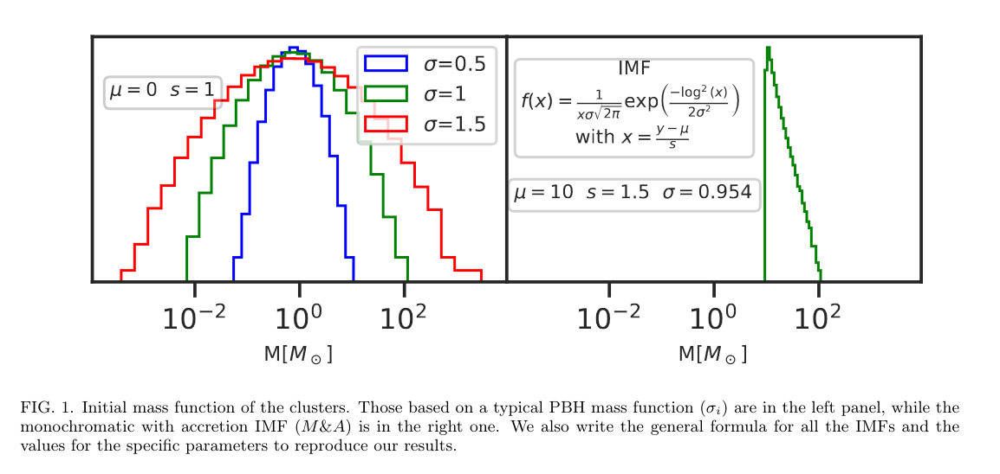

# About

This experiment is based on article [Primordial Black Hole clusters, phenomenology & implications](https://arxiv.org/pdf/2405.06391v1) by Juan Garcia-Bellido.

The goal of this experiment is to create a self-consistent model with Plummer density profile and log-normal mass spectrum, and then evolve it for Hubble time.



Mass spectra used in the article.

# How to reproduce

To reproduce the experiment, follow these steps:

- Activate the Agama environment:

  ```shell
  conda activate agama
  ```

- Start Nemo (from `nemo` repository root):

  ```shell
  source start_nemo.sh
  ```

- Create initial coordinates for evolution:

  ```shell
  cd 2.\ Reproduce\ JGB/
  python create_ic.py --mean <MEAN> --sigma <SIGMA> --scale <SCALE> --r <PLUMMER_RADIUS> --N <N>
  ```

  Here `N` is the number of particles in simulation, `MEAN`, `SIGMA`, and `SCALE` are log-normal distribution parameters of PBH mass spectrum, and `PLUMMER_RADIUS` is a characteristic size of Plummer density distribution (type `python create_ic.py --help` for more details).

  The above command will automatically create (or re-create) a directory with name `snap_m<MEAN>_s<SIGMA>_r<PLUMMER_RADIUS>_N<N>` containing file `IC.nemo` with initial coordinates for evolution.

  To reproduce the results from the article, use these parameters combinations:

  | $\\mu$, $M\_{☉}$ | s, $M\_{☉}$ | $\\sigma$, $M\_{☉}$ | Plummer radius, pc | Number of particles |
  | ---------------- | ----------- | ------------------- | ------------------ | ------------------- |
  | 0                | 1           | 0.5                 | 10                 | $2 \\mul 10^4$      |
  | 0                | 1           | 1                   | 10                 | $2 \\mul 10^4$      |
  | 0                | 1           | 1.5                 | 10                 | $2 \\mul 10^4$      |
  | 10               | 1.5         | 0.954               | 10                 | $2 \\mul 10^4$      |

- Evolve for a couple of crossing times:

  ```shell
  gyrfalcON in=<DIRNAME>/IC.nemo out=<DIRNAME>/out.nemo eps=<eps> kmax=<kmax> Grav=<Grav> tstop=<tstop> step=<step> logstep=300
  ```

  Here `DIRNAME` is the name of the directory with `IC.nemo`, and `logstep=300` is a parameter which controls console output size. Other parameters such as `<eps>`, `<kmax>` and `<Grav>` should be thoroughly chosen. The previous python script `create_ic.py` prints a set of recommended `gyrfalcON` parameters at the end of the output.

# Explore results

- Visualize cluster evolution:

  ```shell
  snapplot3 <DIRNAME>/out.nemo
  ```

  There is also a possibility to visulaize the evolution using [glnemo2](https://projets.lam.fr/projects/glnemo2/wiki/download).

- Plot mass density $$\\rho(r)$$ for the resulting snapshot and compare with initial density:

  ```shell
  python plot_snap_density.py --nemo-file <DIRNAME>/out.nemo --times <t1> <t2> ... <tn> --mean <MEAN> --sigma <SIGMA> --scale <SCALE> --r <PLUMMER_RADIUS>
  ```

  `<t1> <t2> ... <tn>` means that all timestamps from snapshot that you want to use to plot the graph should be separated by a space.
  E.g., `0.0 1.0 2.0`.

  When you evolve a cluster in its own gravitational field, the final density should look like the initial density. This indicates that your model is truly self-consistent.

- Compute and plot mass spectrum for a given snapshot along with the original distribution function:

  ```shell
  python plot_mass_spectrum.py --nemo-file <DIRNAME>/out.nemo --times <t1> <t2> ... <tn> --mean <MEAN> --sigma <SIGMA> --scale <SCALE> --r <PLUMMER_RADIUS>
  ```
