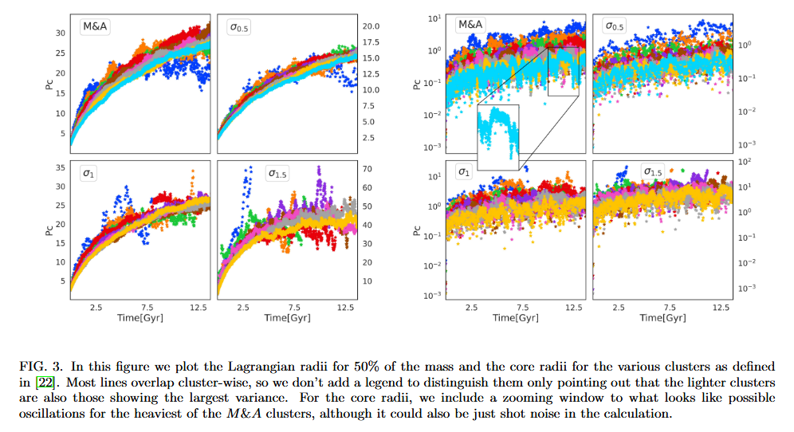

# About

This experiment is based on article [Primordial Black Hole clusters, phenomenology & implications](https://arxiv.org/pdf/2405.06391v1) by Juan Garcia-Bellido (shortly: JGB).

The goal of this experiment is to create a self-consistent model with Plummer density profile and log-normal mass spectrum, and then evolve it for Hubble time.


Mass spectra used in the article.

# How to reproduce

To reproduce the experiment, follow this pipeline:

- Activate the Agama environment:

  ```shell
  conda activate agama
  ```

- Start Nemo (from `nemo` repository root):

  ```shell
  source start_nemo.sh
  ```

- Create initial coordinates for evolution:

  ```shell
  cd 2.\ Reproduce\ JGB/
  python create_ic.py --mean <MEAN> --sigma <SIGMA> --scale <SCALE> --r <PLUMMER_RADIUS> --N <N>
  ```

  Here `N` is the number of particles in simulation, `MEAN`, `SIGMA`, and `SCALE` are log-normal distribution parameters of PBH mass spectrum, and `PLUMMER_RADIUS` is a characteristic size of Plummer density distribution (type `python create_ic.py --help` for more details).

  The above command will automatically create (or re-create) a directory with name `snap_mu<MEAN>_s<SCALE>_sigma<SIGMA>_r<PLUMMER_RADIUS>_N<N>` containing file `IC.nemo` with initial coordinates for evolution.

- Pre-process data

- Evolve for a couple of crossing times:

  ```shell
  gyrfalcON in=<DIRNAME>/<IC_COORDINATES>.nemo out=<DIRNAME>/out.nemo eps=<eps> kmax=<kmax> Grav=<Grav> tstop=<tstop> step=<step> logstep=300
  ```

  Here `logstep=300` is the parameter which controls console output size. Other parameters such as `<eps>`, `<kmax>` and `<Grav>` should be thoroughly chosen. The previous python script `create_ic.py` prints a set of recommended `gyrfalcON` parameters at the end of the output (don't forget to change `tstop` parameter according to how many crossing times you want to use). If you preprocess your data, you should adjust these parameters according to your preprocessing procedure.

- Post-process data

You may use your own parameters for the experiments. To reproduce the original article, use the combinations of parameters listed below:

| Experiment name | $\\mu$, $M\_{☉}$ | s, $M\_{☉}$ | $\\sigma$ | Plummer radius, pc | Number of particles | Script to reproduce evolution  |
| --------------- | ---------------- | ----------- | --------- | ------------------ | ------------------- | ------------------------------ |
| $\\sigma$ = 0.5 | 0                | 1           | 0.5       | 10                 | $2 \\times 10^4$    | sh_scripts/run_exp_sigma0.5.sh |
| $\\sigma$ = 1   | 0                | 1           | 1         | 10                 | $2 \\times 10^4$    | sh_scripts/run_exp_sigma1.0.sh |
| $\\sigma$ = 1.5 | 0                | 1           | 1.5       | 10                 | $2 \\times 10^4$    | sh_scripts/run_exp_sigma1.5.sh |
| M & A           | 10               | 1.5         | 0.954     | 10                 | $2 \\times 10^4$    | sh_scripts/run_exp_MA.sh       |

You may use bash scripts `run_exp*.sh` to run evolution, for example:

```shell
bash sh_scripts/run_exp_MA.sh
```

or run commands one-by-one using the instruction given in the next section.

> Note that all python scripts in this experiment overwrite the existing files.
> Don't forget to backup your experiments before trying to reproduce them!

## External potential

This section desctibes how to perform the evolution of PBH cluster in an external potential of SMBH. It is assumed that you have already created cluster's initial coordinates for evolution `DIRNAME/IC.nemo` using `create_ic.py` (see previous section).

- JGB writes:

  > Clusters are themselves immersed in a central gravitational potential with orbital radius $R_c$ = 34 kpc and central mass $M = 4.37 × 10^{10} M\_{☉}$ throughout the entire evolution. This is just a point mass approximation which leads to a circular movement of period T = 2.81 Gyr

  The easiest way to create this point-mass potential is to add a new particle representing the central mass to the existing snapshot with PBH cluster data:

  ```shell
  python preprocess_snap.py \
    --nemo-file `DIRNAME`/IC.nemo \
    --r 10 \
    --r-shift 34 0 0 \
    --v-shift 0 -74.35014 0 \
    --add-point-source \
    --source-mass 4.37e10
  ```

  After this step, you will get a new file `<DIRNAME>/IC_preprocessed.nemo` with the old data concatenated with the new data (a steady point of mass $4.37\\times10^{10} M\_\\odot$ at (0, 0, 0)).

  Note that `preprocess.py` also converts parsecs to kiloparsecs for convenience using NEMO's `snapscale`. The reverse transformation is performed by `postrprocess.py`.

- Run evolution of this snapshot wuth SMBH:

  ```shell
  gyrfalcON in=<DIRNAME>/IC_preprocessed.nemo out=<DIRNAME>/<OUT_NAME>.nemo eps=<eps> kmax=<kmax> Grav=<Grav> tstop=<tstop> step=<step> logstep=300
  ```

  A set of recommended parameters for `gyrFalcON` is provided by `preprocess_snap.py` script at the end of its output.

## Postprocess

It would be useful to postprocess your data to plot profiles, spectras, etc.

To postprocess snapshot evolved in JGB potential (the original article), run:

```shell
python postprocess.py --nemo-file <DIRNAME>/<OUT_NAME>.nemo --remove-point-source
```

The postprocessed file with name `<OUT_NAME>_postprocessed.nemo` will be stored in `<DIRNAME>` folder.

> If you used sh-scripts to reproduce the experiments, the postprocessing procedure has already been done for you.

# Explore results

## Visualize cluster evolution

- To visualize cluster evolution, run:

  ```shell
  snapplot3 <DIRNAME>/out.nemo
  ```

  Use these options for customization:

  ```shell
  snapplot <DIRNAME>/out.nemo xrange=<xmin>:<xmax> yrange=<ymin>:<ymax> times=<tmin>:<tmax>
  ```

- There is also a possibility to visulaize the evolution using [glnemo2](https://projets.lam.fr/projects/glnemo2/wiki/download).

- Another option is to use custom visualization script from this repository:

  ```shell
  python animate.py --nemo-file <DIRNAME>/out_postprocessed.nemo --times <t1> <t2> ... <tn> <POTENTIAL-OPTION>
  ```

  `--times <t1> <t2> ... <tn>` means that all timestamps from snapshot that you want to use to plot the graph should be separated by a space.
  E.g., `--times 0.0 1.0 2.0`. Before feeding timestamps, make sure they are present in the snapshot. To get a list of timestamps from a snapshot, run:

  ```shell
  python stat.py --nemo-file <DIRNAME>/<OUT_NAME>_postprocessed.nemo --n-timestamps <N> --add-point-source
  ```

  where `<N>` is the desired number of timestamps.

  > If you used sh-scripts, check `timestamps.txt` file in directory with your snapshot

## Plot density profile $$\\rho(r)$$

Plot density profile $$\\rho(r)$$ for the resulting snapshot and compare it with initial density:

```shell
python plot_density_profile.py --nemo-file <DIRNAME>/<OUT_NAME>_postprocessed.nemo --times <t1> <t2> ... <tn> --mean <MEAN> --sigma <SIGMA> --scale <SCALE> --r <PLUMMER_RADIUS>
```

## Plot Lagrange radii

To plot Lagrange radius at different timestamps for different experiments, run:

```shell
python plot_lagrange_radius.py --nemo-files <DIRNAME1>/<OUT_NAME>_postprocessed.nemo <DIRNAME2>/<OUT_NAME>_postprocessed.nemo --times <t1> <t2> ... <tn>
```

As NEMO's tool for computation of cluster's density center sometimes fail and I haven't fixed it yet, it is better to add `--remove-outliers` at the end of the command:

```shell
python plot_lagrange_radius.py --nemo-files <DIRNAME1>/<OUT_NAME>_postprocessed.nemo <DIRNAME2>/<OUT_NAME>_postprocessed.nemo --times <t1> <t2> ... <tn> --remove-outliers
```

You can compare your results with plots from the article:




Note that Lagrange radius at t=0 should be approximately 13 pc according to [analytical expression](https://en.wikipedia.org/wiki/Plummer_model) for Plummer with size 10 pc

## Plot mass spectrum $$f(M)$$

Compute and plot mass spectrum for a given snapshot along with the original distribution function:

```shell
python plot_mass_spectrum.py --nemo-file <DIRNAME>/<OUT_NAME>_postprocessed.nemo --times <t1> <t2> ... <tn> --mean <MEAN> --sigma <SIGMA> --scale <SCALE> --r <PLUMMER_RADIUS>
```

The mass distribution for your snapshot (the resulting histograms) and original pdf (the line plot) should look like a log-normal distribution with your parameters at $t=0$. You can compare your results with the picture of log-normal distributions at the beginning of this README document.

To plot the distribution of masses only for particles inside the half-mass radius, run:

```shell
python plot_mass_spectrum.py --nemo-file <DIRNAME>/<OUT_NAME>_postprocessed.nemo --times <t1> <t2> ... <tn> --mean <MEAN> --sigma <SIGMA> --scale <SCALE> --r <PLUMMER_RADIUS> --lagrange --remove-outliers
```

# Test pipeline

To test your pipeline, you may evolve a cluster in its own gravitational field (without any potentials). The final density after the evolution should look like the initial density. This indicates that your model is truly self-consistent.

# Checklist

Here is a list of what we need to fully reproduce the article:

- [x] N-body simulation
- [ ] Comparison between Nbody6++GPU (or Nbody6) and GyrfalcON
- [ ] Gravitational waves
- [ ] Black hole mergers
